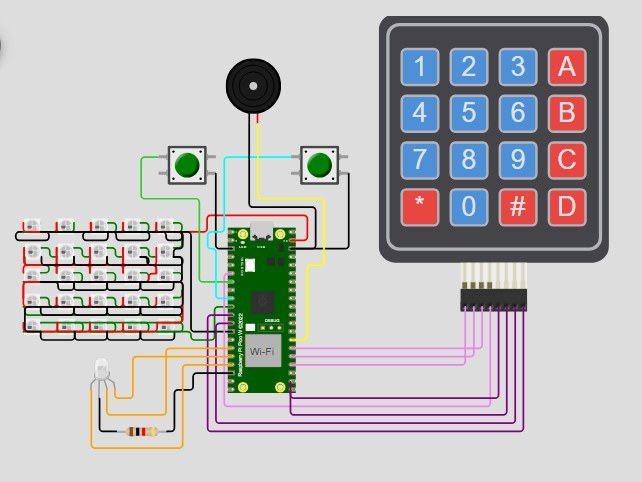

# Atividade (Obrigatória): Geração de animações em uma matriz de LEDs 5x5

# LED Matrix Animation - Projeto com Raspberry Pi Pico  

## Estrutura do Projeto  

- **arqs/** → Diretório com arquivos auxiliares.  
- **build/** → Diretório de compilação gerado pelo CMake.  
- **img/** → Imagens do projeto.  
- **libs/** → Bibliotecas personalizadas usadas no projeto.  
- **CMakeLists.txt** → Configuração do CMake para compilação.  
- **LED-Matrix-Animation.c** → Código principal do projeto.  
- **MatrixKeypad.c/h** → Biblioteca para controle do teclado matricial.  
- **pio_config.h** → Configuração do PIO para LEDs NeoPixel.  
- **pico_sdk_import.cmake** → Importação do SDK do Raspberry Pi Pico.  
- **README.md** → Documentação do projeto.  
- **teclado.h** → Definições e funções para o teclado.  
- **wokwi.toml / wokwi-project.txt** → Arquivos de configuração para simulação no Wokwi.  
- **ws2818b.pio / ws2818b.pio.h** → Código PIO para controle dos LEDs WS2812B.  


## **Líder da Equipe**

Hugo S. Dias

---

## **Colaboradores e Proposta para Divisão das Tarefas**

1. **Líder da equipe** - `Hugo S. Dias`
2. **Inicialização e preparação codigo base - inicial**. - `JACKSON SILVA DOS SANTOS`
3. **Configuração e integração do teclado matricial (4x4).** - `HUGO S. DIAS`
4. **Controle e animação dos LEDs para tecla "0".** - `JACKSON SILVA DOS SANTOS`
5. **Controle e animação dos LEDs para tecla "1".** - `ALINNE DE SOUZA SANTOS CASTRO`
6. **Controle e animação dos LEDs para tecla "2".** - `ALINNE DE SOUZA SANTOS CASTRO`
7. **Controle e animação dos LEDs para tecla "3".** - `JOÃO VITOR SOARES AMORIM`
8. **Controle e animação dos LEDs para tecla "4".** - `JOÃO VITOR SOARES AMORIM`
9. **Controle e animação dos LEDs para tecla "5".** - `HUGO S. DIAS`
10. **Controle e animação dos LEDs para tecla "6".** - `ARTHUR ALENCAR LOPES TRINDADE`
11. **Controle e animação dos LEDs para tecla "7".** - `SÉRGIO EMÍLIO DA CUNHA MEIRA SANTOS`
12. **Controle e animação dos LEDs para tecla "8".** - `GABRIEL SANTOS DE LACERDA`
13. **Controle e animação dos LEDs para tecla "9".** - `GABRIEL SANTOS DE LACERDA`
14. **Configuração e execução das funcionalidades das teclas A, B, C, D e #** - `JACKSON SILVA DOS SANTOS`
15. **Implementação da tecla \* (modo gravação via software).** - `JACKSON SILVA DOS SANTOS`
16. **Configuração do buzzer (opcional) e participação nos testes.** - `ARTHUR ALENCAR LOPES TRINDADE`
17. **Documentação, usabilidade e IHM - Interface Home Maquina no README.md** - `JOÃO VITOR SOARES AMORIM`
18. **Botões A - BitDogLab - Botão Adicional - som** - `ARTHUR ALENCAR LOPES TRINDADE`
19. **Botões B - BitDogLab - Botão Adicional** - `ALINNE DE SOUZA SANTOS CASTRO`


---

## **Simulador online - ATUALIZADO**

[https://wokwi.com/projects/421083870569621505](https://wokwi.com/projects/421083870569621505 "https://wokwi.com/projects/421083870569621505")

## **Descrição Geral**

Este projeto utiliza um Raspberry Pi Pico W na plataforma de apredizagem BitDogLab, um teclado matricial 4x4 e uma matriz de LEDs RGB 5x5 (WS2812). Ao pressionar teclas específicas no teclado, diferentes animações de LED são exibidas. Além disso, funcionalidades adicionais como ajuste de cores e luminosidade foram implementadas para ampliar a interação.

# Video de apresentação deste projeto

[Video de apresentaçãp do projeto](https://drive.google.com/file/d/1Sh0-EAkNk5okv5hjkzuThFM5QKuJLmUj/view?usp=sharing "Video de apresentaçãp do projeto")

---

## **Funcionalidades**

1. **Animações para teclas de 0 a 9:**  
   Cada tecla exibe uma animação diferente na matriz de LEDs.


   - **Tecla 0:** Animacao para a Tecla 0.
   - **Tecla 1:** Animacao Quadrado Pulsante.
   - **Tecla 2:** Animacao Onda.
   - **Tecla 3:** Animacao Espiral.
   - **Tecla 4:** Animacao Coracao Pulsante.
   - **Tecla 5:** Animacao para a Tecla 5
   - **Tecla 6:** Animacao para a Tecla 6
   - **Tecla 7:** Animacao para a Tecla 7
   - **Tecla 8:** Animacao para a Tecla 8
   - **Tecla 9:** Animacao para a Tecla 9

2. **Funções específicas para teclas especiais:**

   - **A:** Desliga todos os LEDs. 
   - **B:** Liga todos os LEDs na cor azul (100% luminosidade).
   - **C:** Liga todos os LEDs na cor vermelha (80% luminosidade).
   - **D:** Liga todos os LEDs na cor verde (50% luminosidade).
      - **Tecla 0:** Animacao Tecla 0.
      - **Tecla 1:** Animacao Quadrado Pulsante.
      - **Tecla 2:** Animacao Onda.
      - **Tecla 3:** Animacao Espiral.
      - **Tecla 4:** Animacao Coracao Pulsante.
      - **Tecla 5:** O exemplo define 5 frames por segundo com diferentes cores para toda a matriz.
      - **Tecla 6:** animacao_tecla_6
      - **Tecla 7:** animacao_tecla_7
      - **Tecla 8:** Animacao_tecla_8
      - **Tecla 9:** Animacao_tecla_9

2. **Funções específicas para teclas especiais:**  
   - **A:** Desliga todos os LEDs.  
   - **B:** Liga todos os LEDs na cor azul (100% luminosidade).  
   - **C:** Liga todos os LEDs na cor vermelha (80% luminosidade).  
   - **D:** Liga todos os LEDs na cor verde (50% luminosidade).  

   - **#:** Liga todos os LEDs na cor branca (20% luminosidade).

3. **Modo de gravação via tecla \*:**

   - Habilita o modo de gravação (reboot do sistema).

4. **Sinal sonoro opcional:** - Som
   - Um buzzer pode ser configurado para emitir sons.

---

## **Feedback Visual e Impressão**

- Exibe no terminal a tecla pressionada.
- Os LEDs indicam visualmente a interação do usuário.
- O buzzer gera uma musica diferente para cada botão A e B da  BitDogLab

## **Requisitos de Hardware**

- Microcontrolador: Raspberry Pi Pico
- Teclado Matricial: 4x4
- LEDs NeoPixel 5x5
- Resistores (para os LEDs, se necessário)
- Fios e Protoboard para conexões: Para conexões externas a BitDogLab

## **Diagrama de Conexões**



1. **Teclado Matricial (4x4):**

   - Linhas -> GPIOs 18, 19, 20, 4
   - Colunas -> GPIOs 16, 17, 9, 8

2. **Matriz de LEDs RGB 5x5 (WS2812):**

   - Conectada ao GPIO 7

3. **Buzzer (opcional):**
   - Conectado ao GPIO 21
4. **Botões A e B - BitDogLab - Adicional**
   - Conectado ao GPIO 5 e 6

---

## **Configuração do Ambiente**

1. **Instale o SDK do Raspberry Pi Pico:**

- Siga o guia oficial de instalação do [Pico SDK](https://www.raspberrypi.com/documentation/microcontrollers/c_sdk.html).

2. **Clone o repositório:**
   ```bash

   ```

- git clone https://github.com/Embarcatech/LED-Matrix-Animation.git
  cd LED-Matrix-Animation

```

## **Compile o código:**

1. Certifique-se de que o SDK está instalado e funcionando corretamente no VSCode.

2. Usando a extensão do Raspberry Pi Pico Visual Studio Code extension, siga os passos:

3. Clean CMake: Para garantir que o projeto será compilado do zero.

4. Compile Project: Compilação dos binários.

5. Run Project [USB]: Compila e copia o firmware para a placa automaticamente.


## **Funcionamento do Código**

1. **Inicialização**
- Configura os pinos das linhas do teclado como saída.
- Configura os pinos das colunas como entrada com resistores de pull-up.

2. **Leitura do Teclado**
- Verifica as colunas ativas para identificar a tecla pressionada.

3. **Controle de LEDs**
- Define o estado de cada LED ou a animação com base na tecla pressionada.

4. **Loop Principal**
 -Monitora continuamente as teclas pressionadas.
 -Atualiza os LEDs e imprime a tecla pressionada na saída padrão.


## **Como Usar**

1. Conecte os componentes conforme o diagrama de conexões.
2. Carregue o firmware no Raspberry Pi Pico W.
3. Interaja com o teclado para observar as animações e funcionalidades implementadas.


```
